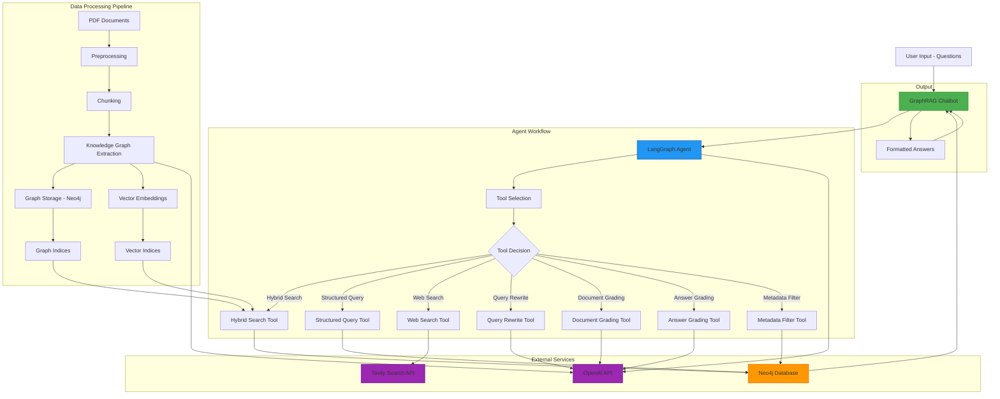

# GraphRAG Architecture Diagram

## Architecture Components

### 1. Data Ingestion Pipeline
- **Preprocessing**: Extracts clean text from PDF documents
- **Chunking**: Creates manageable text chunks for processing
- **Knowledge Graph Extraction**: Uses LangChain structured extraction to convert text to graph format
- **Storage**: Stores both graph structure and vector embeddings in Neo4j

### 2. Query Processing Layer
- **LangGraph Agent**: Intelligent agent that reasons about query type and selects appropriate tools
- **Tool Ecosystem**: Specialized tools for different query patterns and validation

### 3. Retrieval System
- **Hybrid Search**: Combines vector and keyword search for comprehensive results
- **Structured Queries**: Direct Cypher queries for precise graph traversal
- **Web Search**: External search for current information

### 4. Quality Control
- **Adaptive RAG**: Query rewriting for optimization
- **CRAG**: Document relevance grading
- **Self-RAG**: Answer quality and hallucination detection

### 5. External Services
- **OpenAI**: LLM processing for extraction and reasoning
- **Tavily**: Web search capabilities
- **Neo4j**: Graph database with vector search capabilities
